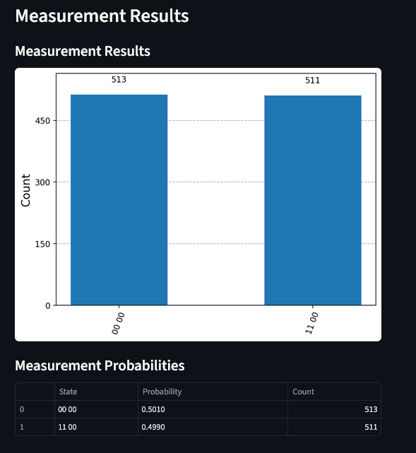
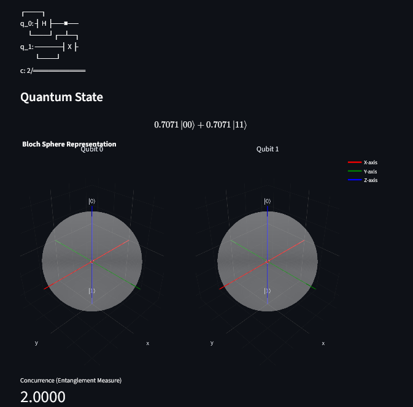
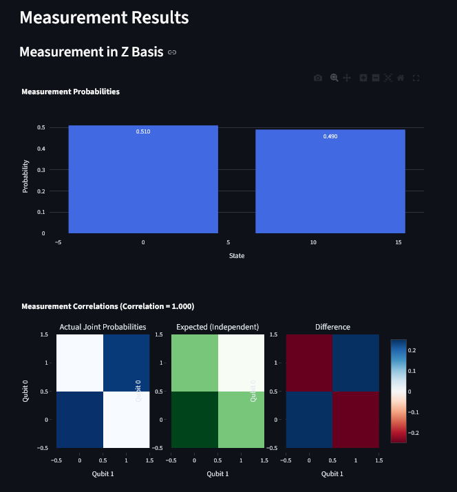
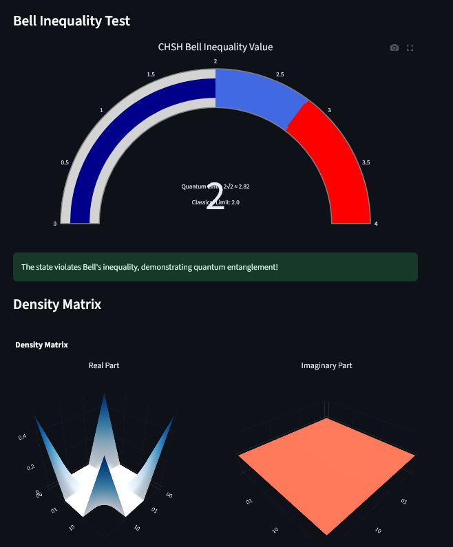
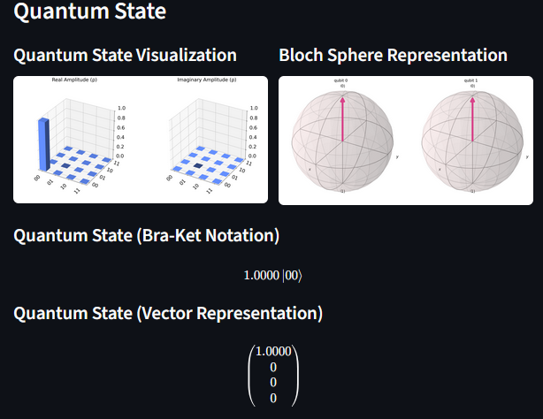
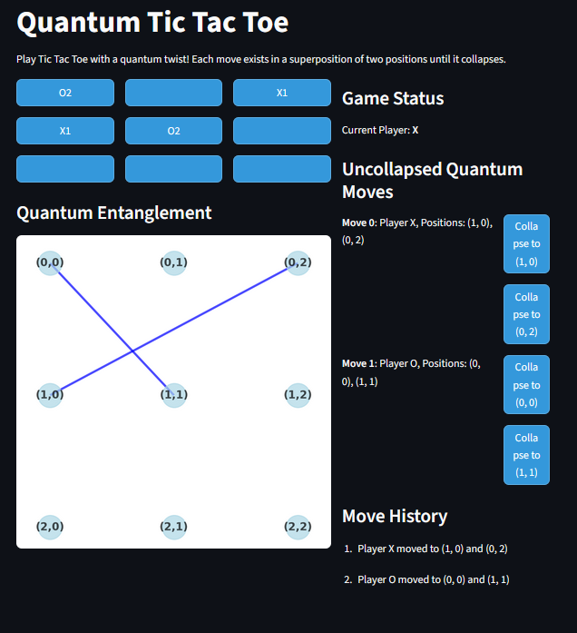
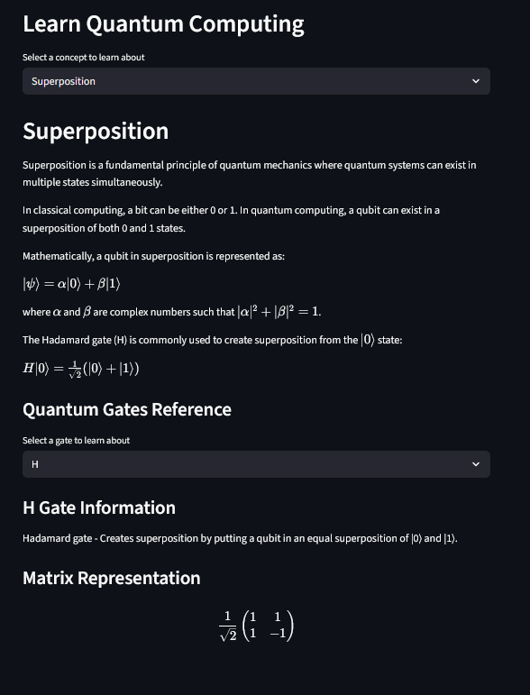
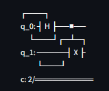
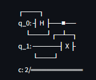
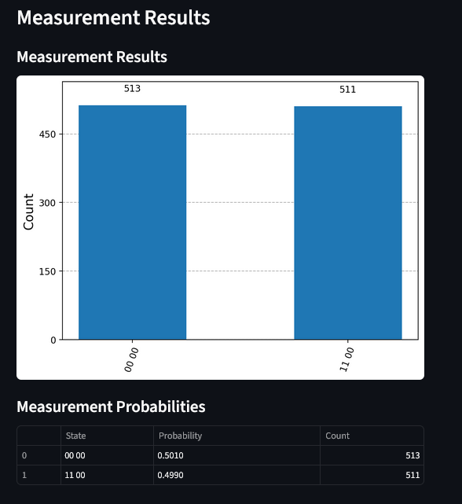

# Quantum Computing Projects | Projets d'Informatique Quantique | Proyectos de Computación Cuántica | Quantencomputing-Projekte

<div align="center">
  
  
  [English](#english) | [Français](#français) | [Español](#español) | [Deutsch](#deutsch)
  
  
  
  
  
</div>

---

<a name="english"></a>
# 🇬🇧 Quantum Computing Projects

<p align="center">
  
</p>

This repository contains three interactive quantum computing projects that demonstrate fundamental quantum concepts through visual and interactive interfaces.

## Table of Contents
- [Overview](#overview)
- [Projects](#projects)
  - [Quantum Circuit Simulator](#quantum-circuit-simulator)
  - [Entanglement Visualizer](#entanglement-visualizer)
  - [Quantum Tic Tac Toe](#quantum-tic-tac-toe)
- [Requirements](#requirements)
- [Installation](#installation)
- [Running the Projects](#running-the-projects)
- [Quantum Concepts](#quantum-concepts)
- [Troubleshooting](#troubleshooting)
- [Credits](#credits)

## Overview

The three projects are:

1. **Quantum Circuit Simulator**: Build, visualize, and simulate quantum circuits with a user-friendly interface.
2. **Entanglement Visualizer**: Explore quantum entanglement and observe the effects of measurement on entangled qubits.
3. **Quantum Tic Tac Toe**: Play a quantum version of Tic Tac Toe where moves exist in superposition until they collapse.

## Projects

### Quantum Circuit Simulator

<p align="center">
  
</p>

The Quantum Circuit Simulator allows you to:
- Add various quantum gates (Hadamard, Pauli-X/Y/Z, CNOT, etc.)
- Visualize the circuit diagram
- Run simulations with multiple shots
- View the measurement probabilities
- Explore the quantum state in different representations (statevector, Bloch sphere)

<p align="center">
  
  
</p>

### Entanglement Visualizer

<p align="center">
  
</p>

The Entanglement Visualizer allows you to:
- Create different types of entangled states (Bell states, GHZ states, W states)
- Measure qubits in different bases
- Visualize the correlations between measurements
- Test Bell's inequality
- Explore the density matrix and reduced density matrices

<p align="center">
  
  
</p>

### Quantum Tic Tac Toe

<p align="center">
  
</p>

Quantum Tic Tac Toe introduces quantum mechanics to the classic game:
- Each move is a superposition of two positions
- Moves collapse when they interfere with other moves
- Players can force collapses strategically
- The game visualizes quantum entanglement between positions
- You can play against an AI with different difficulty levels

<p align="center">
  
  
</p>

## Requirements

All projects require Python 3.10+ and the following common dependencies:
- Qiskit
- Streamlit
- NumPy
- Matplotlib/Plotly

Each project has its own `requirements.txt` file with specific dependencies.

## Installation

There are two ways to install the required dependencies:

### Option 1: Using the Launcher Scripts (Recommended)

The launcher scripts include automatic dependency detection and installation:

1. Clone this repository:
```bash
git clone <repository-url>
cd <repository-directory>
```

2. Create a virtual environment (optional but recommended):
```bash
python -m venv .venv
# On Windows
.venv\Scripts\activate
# On macOS/Linux
source .venv/bin/activate
```

3. Run any of the launcher scripts:
```bash
python launcher.py
# Or for a specific project
python quantum_simulator/launcher.py
```

4. If Streamlit or other dependencies are missing, the launcher will:
   - Detect the missing dependencies
   - Ask if you want to install them automatically
   - Install all required dependencies from the project's requirements.txt file

This is the easiest way to get started, as the launcher handles all dependency management for you.

### Option 2: Manual Installation

If you prefer to install dependencies manually:

1. Clone this repository:
```bash
git clone <repository-url>
cd <repository-directory>
```

2. Create a virtual environment (optional but recommended):
```bash
python -m venv .venv
# On Windows
.venv\Scripts\activate
# On macOS/Linux
source .venv/bin/activate
```

3. Install the dependencies for the project you want to run:
```bash
# For Quantum Circuit Simulator
pip install -r quantum_simulator/requirements.txt

# For Entanglement Visualizer
pip install -r entanglement_visualizer/requirements.txt

# For Quantum Tic Tac Toe
pip install -r quantum_tictactoe/requirements.txt
```

## Running the Projects

There are two ways to run the projects: using the launcher scripts or directly with Streamlit.

### Using the Launcher Scripts (Recommended)

The easiest way to run the projects is to use the launcher scripts, which will:
- Automatically use the correct Streamlit command
- Check if required dependencies are installed
- Offer to install missing dependencies automatically
- Provide clear feedback during the installation process
- Work reliably on all operating systems, including Windows with spaces in the path

#### Main Launcher

To choose which project to run from a menu:

```bash
python launcher.py
```

<p align="center">
  
</p>

This will display a menu where you can select which project to launch.

#### Individual Project Launchers

Each project also has its own launcher script:

```bash
# For Quantum Circuit Simulator
python quantum_simulator/launcher.py

# For Entanglement Visualizer
python entanglement_visualizer/launcher.py

# For Quantum Tic Tac Toe
python quantum_tictactoe/launcher.py
```

If Streamlit or other dependencies are missing when you run a launcher script, you'll be prompted to install them automatically. This makes it easy to get started without having to manually install dependencies.

### Using Streamlit Directly

If you prefer, you can also run the projects directly with Streamlit:

#### Quantum Circuit Simulator

```bash
cd quantum_simulator
streamlit run main.py
```

This will open a web interface where you can:
- Add quantum gates to qubits
- Visualize the circuit
- Run simulations
- View measurement results and quantum states

#### Entanglement Visualizer

```bash
cd entanglement_visualizer
streamlit run app.py
```

This will open a web interface where you can:
- Create different entangled states (Bell states, GHZ states, W states)
- Choose measurement bases
- Visualize correlations between entangled qubits
- Explore Bell's inequality

#### Quantum Tic Tac Toe

```bash
cd quantum_tictactoe
streamlit run app.py
```

This will open a web interface where you can:
- Play Tic Tac Toe with quantum moves (superpositions)
- Observe entanglement between positions
- Force quantum collapses
- Play against an AI opponent

> **Note:** It's important to use the `streamlit run` command when running the applications directly, not `python`. The launcher scripts handle this automatically for you.

## Quantum Concepts

### Superposition

<p align="center">
  
</p>

In quantum computing, qubits can exist in multiple states simultaneously, unlike classical bits that can only be 0 or 1. This is called superposition.

For example, a qubit can be in a state that is a combination of |0⟩ and |1⟩:
|ψ⟩ = α|0⟩ + β|1⟩

where α and β are complex numbers such that |α|² + |β|² = 1.

### Entanglement

<p align="center">
  
</p>

Entanglement is a quantum phenomenon where two or more qubits become correlated in such a way that the quantum state of each qubit cannot be described independently of the others.

The Bell states are the simplest examples of entangled states:
- |Φ⁺⟩ = (|00⟩ + |11⟩)/√2
- |Φ⁻⟩ = (|00⟩ - |11⟩)/√2
- |Ψ⁺⟩ = (|01⟩ + |10⟩)/√2
- |Ψ⁻⟩ = (|01⟩ - |10⟩)/√2

### Measurement

<p align="center">
  
</p>

When we measure a qubit in superposition, it collapses to one of its basis states with a probability determined by the amplitudes of the quantum state.

For a qubit in state |ψ⟩ = α|0⟩ + β|1⟩:
- The probability of measuring 0 is |α|²
- The probability of measuring 1 is |β|²

## Troubleshooting

### Common Issues

#### "Error launching application: [WinError 2] The specified file was not found"
This error can occur on Windows systems, especially when the project path contains spaces. The launcher scripts have been updated to handle this issue. If you still encounter this error:
- Make sure Streamlit is properly installed in your Python environment
- Try running the launcher script with administrator privileges
- Ensure your Python environment is activated if you're using a virtual environment

#### "ImportError: cannot import name 'Aer' from 'qiskit'"
This error occurs because in newer versions of Qiskit, the Aer module has been moved to a separate package. To fix this:
- Make sure you have the qiskit-aer package installed: `pip install qiskit-aer`
- The launcher scripts should detect and install this dependency automatically

#### "Session state does not function when running a script without `streamlit run`"
This warning appears when trying to run a Streamlit app directly with Python instead of using the `streamlit run` command. Always use the launcher scripts or the `streamlit run` command to run the applications.

## Credits

These projects were created to demonstrate quantum computing concepts in an interactive and visual way. They use the following open-source libraries:
- [Qiskit](https://qiskit.org/) - IBM's open-source quantum computing framework
- [Streamlit](https://streamlit.io/) - Framework for creating web applications
- [NumPy](https://numpy.org/) - Numerical computing library
- [Matplotlib](https://matplotlib.org/) and [Plotly](https://plotly.com/) - Data visualization libraries
- [NetworkX](https://networkx.org/) - Network analysis library

---

<a name="français"></a>
# 🇫🇷 Projets d'Informatique Quantique

<p align="center">
  
</p>

Ce dépôt contient trois projets interactifs d'informatique quantique qui démontrent les concepts quantiques fondamentaux à travers des interfaces visuelles et interactives.

## Table des Matières
- [Aperçu](#aperçu)
- [Projets](#projets)
  - [Simulateur de Circuits Quantiques](#simulateur-de-circuits-quantiques)
  - [Visualisateur d'Intrication](#visualisateur-dintrication)
  - [Morpion Quantique](#morpion-quantique)
- [Prérequis](#prérequis)
- [Installation](#installation-fr)
- [Exécution des Projets](#exécution-des-projets)
- [Concepts Quantiques](#concepts-quantiques)
- [Dépannage](#dépannage)
- [Crédits](#crédits-fr)

## Aperçu

Les trois projets sont :

1. **Simulateur de Circuits Quantiques** : Construire, visualiser et simuler des circuits quantiques avec une interface conviviale.
2. **Visualisateur d'Intrication** : Explorer l'intrication quantique et observer les effets de la mesure sur des qubits intriqués.
3. **Morpion Quantique** : Jouer à une version quantique du Morpion où les coups existent en superposition jusqu'à ce qu'ils s'effondrent.

## Projets

### Simulateur de Circuits Quantiques

<p align="center">
  
</p>

Le Simulateur de Circuits Quantiques vous permet de :
- Ajouter diverses portes quantiques (Hadamard, Pauli-X/Y/Z, CNOT, etc.)
- Visualiser le diagramme du circuit
- Exécuter des simulations avec plusieurs tirs
- Voir les probabilités de mesure
- Explorer l'état quantique dans différentes représentations (vecteur d'état, sphère de Bloch)

<p align="center">
  
  
</p>

### Visualisateur d'Intrication

<p align="center">
  
</p>

Le Visualisateur d'Intrication vous permet de :
- Créer différents types d'états intriqués (états de Bell, états GHZ, états W)
- Mesurer les qubits dans différentes bases
- Visualiser les corrélations entre les mesures
- Tester l'inégalité de Bell
- Explorer la matrice de densité et les matrices de densité réduites

<p align="center">
  
  
</p>

### Morpion Quantique

<p align="center">
  
</p>

Le Morpion Quantique introduit la mécanique quantique dans le jeu classique :
- Chaque coup est une superposition de deux positions
- Les coups s'effondrent lorsqu'ils interfèrent avec d'autres coups
- Les joueurs peuvent forcer des effondrements de manière stratégique
- Le jeu visualise l'intrication quantique entre les positions
- Vous pouvez jouer contre une IA avec différents niveaux de difficulté

## Prérequis

Tous les projets nécessitent Python 3.10+ et les dépendances communes suivantes :
- Qiskit
- Streamlit
- NumPy
- Matplotlib/Plotly

Chaque projet a son propre fichier `requirements.txt` avec des dépendances spécifiques.

<a name="installation-fr"></a>
## Installation

Il y a deux façons d'installer les dépendances requises :

### Option 1 : Utilisation des Scripts de Lancement (Recommandé)

Les scripts de lancement incluent la détection et l'installation automatiques des dépendances :

1. Clonez ce dépôt :
```bash
git clone <url-du-dépôt>
cd <répertoire-du-dépôt>
```

2. Créez un environnement virtuel (optionnel mais recommandé) :
```bash
python -m venv .venv
# Sur Windows
.venv\Scripts\activate
# Sur macOS/Linux
source .venv/bin/activate
```

3. Exécutez l'un des scripts de lancement :
```bash
python launcher.py
# Ou pour un projet spécifique
python quantum_simulator/launcher.py
```

4. Si Streamlit ou d'autres dépendances sont manquantes, le lanceur va :
   - Détecter les dépendances manquantes
   - Vous demander si vous souhaitez les installer automatiquement
   - Installer toutes les dépendances requises à partir du fichier requirements.txt du projet

C'est la façon la plus simple de commencer, car le lanceur gère toute la gestion des dépendances pour vous.

### Option 2 : Installation Manuelle

Si vous préférez installer les dépendances manuellement :

1. Clonez ce dépôt :
```bash
git clone <url-du-dépôt>
cd <répertoire-du-dépôt>
```

2. Créez un environnement virtuel (optionnel mais recommandé) :
```bash
python -m venv .venv
# Sur Windows
.venv\Scripts\activate
# Sur macOS/Linux
source .venv/bin/activate
```

3. Installez les dépendances pour le projet que vous souhaitez exécuter :
```bash
# Pour le Simulateur de Circuits Quantiques
pip install -r quantum_simulator/requirements.txt

# Pour le Visualisateur d'Intrication
pip install -r entanglement_visualizer/requirements.txt

# Pour le Morpion Quantique
pip install -r quantum_tictactoe/requirements.txt
```

## Exécution des Projets

Il y a deux façons d'exécuter les projets : en utilisant les scripts de lancement ou directement avec Streamlit.

### Utilisation des Scripts de Lancement (Recommandé)

La façon la plus simple d'exécuter les projets est d'utiliser les scripts de lancement, qui vont :
- Utiliser automatiquement la commande Streamlit correcte
- Vérifier si les dépendances requises sont installées
- Proposer d'installer automatiquement les dépendances manquantes
- Fournir des retours clairs pendant le processus d'installation
- Fonctionner de manière fiable sur tous les systèmes d'exploitation, y compris Windows avec des espaces dans le chemin

#### Lanceur Principal

Pour choisir quel projet exécuter à partir d'un menu :

```bash
python launcher.py
```

<p align="center">
  
</p>

Cela affichera un menu où vous pourrez sélectionner quel projet lancer.

#### Lanceurs de Projets Individuels

Chaque projet a également son propre script de lancement :

```bash
# Pour le Simulateur de Circuits Quantiques
python quantum_simulator/launcher.py

# Pour le Visualisateur d'Intrication
python entanglement_visualizer/launcher.py

# Pour le Morpion Quantique
python quantum_tictactoe/launcher.py
```

Si Streamlit ou d'autres dépendances sont manquantes lorsque vous exécutez un script de lancement, vous serez invité à les installer automatiquement. Cela facilite le démarrage sans avoir à installer manuellement les dépendances.

### Utilisation Directe de Streamlit

Si vous préférez, vous pouvez également exécuter les projets directement avec Streamlit :

#### Simulateur de Circuits Quantiques

```bash
cd quantum_simulator
streamlit run main.py
```

Cela ouvrira une interface web où vous pourrez :
- Ajouter des portes quantiques aux qubits
- Visualiser le circuit
- Exécuter des simulations
- Voir les résultats de mesure et les états quantiques

#### Visualisateur d'Intrication

```bash
cd entanglement_visualizer
streamlit run app.py
```

Cela ouvrira une interface web où vous pourrez :
- Créer différents états intriqués (états de Bell, états GHZ, états W)
- Choisir des bases de mesure
- Visualiser les corrélations entre les qubits intriqués
- Explorer l'inégalité de Bell

#### Morpion Quantique

```bash
cd quantum_tictactoe
streamlit run app.py
```

Cela ouvrira une interface web où vous pourrez :
- Jouer au Morpion avec des coups quantiques (superpositions)
- Observer l'intrication entre les positions
- Forcer des effondrements quantiques
- Jouer contre un adversaire IA

> **Remarque :** Il est important d'utiliser la commande `streamlit run` lors de l'exécution directe des applications, et non `python`. Les scripts de lancement gèrent cela automatiquement pour vous.

## Concepts Quantiques

### Superposition

<p align="center">
  
</p>

En informatique quantique, les qubits peuvent exister dans plusieurs états simultanément, contrairement aux bits classiques qui ne peuvent être que 0 ou 1. C'est ce qu'on appelle la superposition.

Par exemple, un qubit peut être dans un état qui est une combinaison de |0⟩ et |1⟩ :
|ψ⟩ = α|0⟩ + β|1⟩

où α et β sont des nombres complexes tels que |α|² + |β|² = 1.

### Intrication

<p align="center">
  
</p>

L'intrication est un phénomène quantique où deux ou plusieurs qubits deviennent corrélés de telle manière que l'état quantique de chaque qubit ne peut pas être décrit indépendamment des autres.

Les états de Bell sont les exemples les plus simples d'états intriqués :
- |Φ⁺⟩ = (|00⟩ + |11⟩)/√2
- |Φ⁻⟩ = (|00⟩ - |11⟩)/√2
- |Ψ⁺⟩ = (|01⟩ + |10⟩)/√2
- |Ψ⁻⟩ = (|01⟩ - |10⟩)/√2

### Mesure

<p align="center">
  
</p>

Lorsque nous mesurons un qubit en superposition, il s'effondre dans l'un de ses états de base avec une probabilité déterminée par les amplitudes de l'état quantique.

Pour un qubit dans l'état |ψ⟩ = α|0⟩ + β|1⟩ :
- La probabilité de mesurer 0 est |α|²
- La probabilité de mesurer 1 est |β|²

## Dépannage

### Problèmes Courants

#### "Error launching application: [WinError 2] Le fichier spécifié est introuvable"
Cette erreur peut se produire sur les systèmes Windows, en particulier lorsque le chemin du projet contient des espaces. Les scripts de lancement ont été mis à jour pour gérer ce problème. Si vous rencontrez toujours cette erreur :
- Assurez-vous que Streamlit est correctement installé dans votre environnement Python
- Essayez d'exécuter le script de lancement avec des privilèges d'administrateur
- Assurez-vous que votre environnement Python est activé si vous utilisez un environnement virtuel

#### "ImportError: cannot import name 'Aer' from 'qiskit'"
Cette erreur se produit car dans les versions plus récentes de Qiskit, le module Aer a été déplacé vers un package séparé. Pour résoudre ce problème :
- Assurez-vous d'avoir le package qiskit-aer installé : `pip install qiskit-aer`
- Les scripts de lancement devraient détecter et installer automatiquement cette dépendance

#### "Session state does not function when running a script without `streamlit run`"
Cet avertissement apparaît lorsque vous essayez d'exécuter une application Streamlit directement avec Python au lieu d'utiliser la commande `streamlit run`. Utilisez toujours les scripts de lancement ou la commande `streamlit run` pour exécuter les applications.

<a name="crédits-fr"></a>
## Crédits

Ces projets ont été créés pour démontrer les concepts d'informatique quantique de manière interactive et visuelle. Ils utilisent les bibliothèques open-source suivantes :
- [Qiskit](https://qiskit.org/) - Framework d'informatique quantique open-source d'IBM
- [Streamlit](https://streamlit.io/) - Framework pour créer des applications web
- [NumPy](https://numpy.org/) - Bibliothèque de calcul numérique
- [Matplotlib](https://matplotlib.org/) et [Plotly](https://plotly.com/) - Bibliothèques de visualisation de données
- [NetworkX](https://networkx.org/) - Bibliothèque d'analyse de réseaux

---

<a name="español"></a>
# 🇪🇸 Proyectos de Computación Cuántica

<p align="center">
  
</p>

Este repositorio contiene tres proyectos interactivos de computación cuántica que demuestran conceptos cuánticos fundamentales a través de interfaces visuales e interactivas.

## Tabla de Contenidos
- [Visión General](#visión-general)
- [Proyectos](#proyectos)
  - [Simulador de Circuitos Cuánticos](#simulador-de-circuitos-cuánticos)
  - [Visualizador de Entrelazamiento](#visualizador-de-entrelazamiento)
  - [Tres en Raya Cuántico](#tres-en-raya-cuántico)
- [Requisitos](#requisitos)
- [Instalación](#instalación)
- [Ejecución de los Proyectos](#ejecución-de-los-proyectos)
- [Conceptos Cuánticos](#conceptos-cuánticos)
- [Solución de Problemas](#solución-de-problemas)
- [Créditos](#créditos-es)

## Visión General

Los tres proyectos son:

1. **Simulador de Circuitos Cuánticos**: Construir, visualizar y simular circuitos cuánticos con una interfaz amigable.
2. **Visualizador de Entrelazamiento**: Explorar el entrelazamiento cuántico y observar los efectos de la medición en qubits entrelazados.
3. **Tres en Raya Cuántico**: Jugar a una versión cuántica del Tres en Raya donde los movimientos existen en superposición hasta que colapsan.

## Proyectos

### Simulador de Circuitos Cuánticos

<p align="center">
  
</p>

El Simulador de Circuitos Cuánticos te permite:
- Añadir varias puertas cuánticas (Hadamard, Pauli-X/Y/Z, CNOT, etc.)
- Visualizar el diagrama del circuito
- Ejecutar simulaciones con múltiples disparos
- Ver las probabilidades de medición
- Explorar el estado cuántico en diferentes representaciones (vector de estado, esfera de Bloch)

<p align="center">
  
  
</p>

### Visualizador de Entrelazamiento

<p align="center">
  
</p>

El Visualizador de Entrelazamiento te permite:
- Crear diferentes tipos de estados entrelazados (estados de Bell, estados GHZ, estados W)
- Medir qubits en diferentes bases
- Visualizar las correlaciones entre mediciones
- Probar la desigualdad de Bell
- Explorar la matriz de densidad y las matrices de densidad reducidas

<p align="center">
  
  
</p>

### Tres en Raya Cuántico

<p align="center">
  
</p>

El Tres en Raya Cuántico introduce la mecánica cuántica en el juego clásico:
- Cada movimiento es una superposición de dos posiciones
- Los movimientos colapsan cuando interfieren con otros movimientos
- Los jugadores pueden forzar colapsos estratégicamente
- El juego visualiza el entrelazamiento cuántico entre posiciones
- Puedes jugar contra una IA con diferentes niveles de dificultad

## Requisitos

Todos los proyectos requieren Python 3.10+ y las siguientes dependencias comunes:
- Qiskit
- Streamlit
- NumPy
- Matplotlib/Plotly

Cada proyecto tiene su propio archivo `requirements.txt` con dependencias específicas.

## Instalación

Hay dos formas de instalar las dependencias requeridas:

### Opción 1: Usando los Scripts de Lanzamiento (Recomendado)

Los scripts de lanzamiento incluyen detección e instalación automática de dependencias:

1. Clona este repositorio:
```bash
git clone <url-del-repositorio>
cd <directorio-del-repositorio>
```

2. Crea un entorno virtual (opcional pero recomendado):
```bash
python -m venv .venv
# En Windows
.venv\Scripts\activate
# En macOS/Linux
source .venv/bin/activate
```

3. Ejecuta cualquiera de los scripts de lanzamiento:
```bash
python launcher.py
# O para un proyecto específico
python quantum_simulator/launcher.py
```

4. Si Streamlit u otras dependencias faltan, el lanzador:
   - Detectará las dependencias faltantes
   - Te preguntará si deseas instalarlas automáticamente
   - Instalará todas las dependencias requeridas desde el archivo requirements.txt del proyecto

Esta es la forma más fácil de comenzar, ya que el lanzador maneja toda la gestión de dependencias por ti.

### Opción 2: Instalación Manual

Si prefieres instalar dependencias manualmente:

1. Clona este repositorio:
```bash
git clone <url-del-repositorio>
cd <directorio-del-repositorio>
```

2. Crea un entorno virtual (opcional pero recomendado):
```bash
python -m venv .venv
# En Windows
.venv\Scripts\activate
# En macOS/Linux
source .venv/bin/activate
```

3. Instala las dependencias para el proyecto que deseas ejecutar:
```bash
# Para el Simulador de Circuitos Cuánticos
pip install -r quantum_simulator/requirements.txt

# Para el Visualizador de Entrelazamiento
pip install -r entanglement_visualizer/requirements.txt

# Para el Tres en Raya Cuántico
pip install -r quantum_tictactoe/requirements.txt
```

## Ejecución de los Proyectos

Hay dos formas de ejecutar los proyectos: usando los scripts de lanzamiento o directamente con Streamlit.

### Usando los Scripts de Lanzamiento (Recomendado)

La forma más fácil de ejecutar los proyectos es usar los scripts de lanzamiento, que:
- Usarán automáticamente el comando Streamlit correcto
- Verificarán si las dependencias requeridas están instaladas
- Ofrecerán instalar automáticamente las dependencias faltantes
- Proporcionarán retroalimentación clara durante el proceso de instalación
- Funcionarán de manera confiable en todos los sistemas operativos, incluido Windows con espacios en la ruta

#### Lanzador Principal

Para elegir qué proyecto ejecutar desde un menú:

```bash
python launcher.py
```

<p align="center">
  
</p>

Esto mostrará un menú donde puedes seleccionar qué proyecto lanzar.

#### Lanzadores de Proyectos Individuales

Cada proyecto también tiene su propio script de lanzamiento:

```bash
# Para el Simulador de Circuitos Cuánticos
python quantum_simulator/launcher.py

# Para el Visualizador de Entrelazamiento
python entanglement_visualizer/launcher.py

# Para el Tres en Raya Cuántico
python quantum_tictactoe/launcher.py
```

Si Streamlit u otras dependencias faltan cuando ejecutas un script de lanzamiento, se te pedirá que las instales automáticamente. Esto facilita el inicio sin tener que instalar manualmente las dependencias.

### Usando Streamlit Directamente

Si prefieres, también puedes ejecutar los proyectos directamente con Streamlit:

#### Simulador de Circuitos Cuánticos

```bash
cd quantum_simulator
streamlit run main.py
```

Esto abrirá una interfaz web donde podrás:
- Añadir puertas cuánticas a qubits
- Visualizar el circuito
- Ejecutar simulaciones
- Ver resultados de medición y estados cuánticos

#### Visualizador de Entrelazamiento

```bash
cd entanglement_visualizer
streamlit run app.py
```

Esto abrirá una interfaz web donde podrás:
- Crear diferentes estados entrelazados (estados de Bell, estados GHZ, estados W)
- Elegir bases de medición
- Visualizar correlaciones entre qubits entrelazados
- Explorar la desigualdad de Bell

#### Tres en Raya Cuántico

```bash
cd quantum_tictactoe
streamlit run app.py
```

Esto abrirá una interfaz web donde podrás:
- Jugar al Tres en Raya con movimientos cuánticos (superposiciones)
- Observar el entrelazamiento entre posiciones
- Forzar colapsos cuánticos
- Jugar contra un oponente IA

> **Nota:** Es importante usar el comando `streamlit run` al ejecutar las aplicaciones directamente, no `python`. Los scripts de lanzamiento manejan esto automáticamente por ti.

## Conceptos Cuánticos

### Superposición

<p align="center">
  
</p>

En computación cuántica, los qubits pueden existir en múltiples estados simultáneamente, a diferencia de los bits clásicos que solo pueden ser 0 o 1. Esto se llama superposición.

Por ejemplo, un qubit puede estar en un estado que es una combinación de |0⟩ y |1⟩:
|ψ⟩ = α|0⟩ + β|1⟩

donde α y β son números complejos tales que |α|² + |β|² = 1.

### Entrelazamiento

<p align="center">
  
</p>

El entrelazamiento es un fenómeno cuántico donde dos o más qubits se correlacionan de tal manera que el estado cuántico de cada qubit no puede describirse independientemente de los demás.

Los estados de Bell son los ejemplos más simples de estados entrelazados:
- |Φ⁺⟩ = (|00⟩ + |11⟩)/√2
- |Φ⁻⟩ = (|00⟩ - |11⟩)/√2
- |Ψ⁺⟩ = (|01⟩ + |10⟩)/√2
- |Ψ⁻⟩ = (|01⟩ - |10⟩)/√2

### Medición

<p align="center">
  
</p>

Cuando medimos un qubit en superposición, colapsa a uno de sus estados base con una probabilidad determinada por las amplitudes del estado cuántico.

Para un qubit en el estado |ψ⟩ = α|0⟩ + β|1⟩:
- La probabilidad de medir 0 es |α|²
- La probabilidad de medir 1 es |β|²

## Solución de Problemas

### Problemas Comunes

#### "Error launching application: [WinError 2] No se encontró el archivo especificado"
Este error puede ocurrir en sistemas Windows, especialmente cuando la ruta del proyecto contiene espacios. Los scripts de lanzamiento se han actualizado para manejar este problema. Si aún encuentras este error:
- Asegúrate de que Streamlit esté correctamente instalado en tu entorno Python
- Intenta ejecutar el script de lanzamiento con privilegios de administrador
- Asegúrate de que tu entorno Python esté activado si estás usando un entorno virtual

#### "ImportError: cannot import name 'Aer' from 'qiskit'"
Este error ocurre porque en versiones más nuevas de Qiskit, el módulo Aer se ha movido a un paquete separado. Para solucionarlo:
- Asegúrate de tener el paquete qiskit-aer instalado: `pip install qiskit-aer`
- Los scripts de lanzamiento deberían detectar e instalar esta dependencia automáticamente

#### "Session state does not function when running a script without `streamlit run`"
Esta advertencia aparece cuando intentas ejecutar una aplicación Streamlit directamente con Python en lugar de usar el comando `streamlit run`. Siempre usa los scripts de lanzamiento o el comando `streamlit run` para ejecutar las aplicaciones.

<a name="créditos-es"></a>
## Créditos

Estos proyectos fueron creados para demostrar conceptos de computación cuántica de manera interactiva y visual. Utilizan las siguientes bibliotecas de código abierto:
- [Qiskit](https://qiskit.org/) - Framework de computación cuántica de código abierto de IBM
- [Streamlit](https://streamlit.io/) - Framework para crear aplicaciones web
- [NumPy](https://numpy.org/) - Biblioteca de computación numérica
- [Matplotlib](https://matplotlib.org/) y [Plotly](https://plotly.com/) - Bibliotecas de visualización de datos
- [NetworkX](https://networkx.org/) - Biblioteca de análisis de redes

---

<a name="deutsch"></a>
# 🇩🇪 Quantencomputing-Projekte

<p align="center">
  
</p>

Dieses Repository enthält drei interaktive Quantencomputing-Projekte, die grundlegende Quantenkonzepte durch visuelle und interaktive Schnittstellen demonstrieren.

## Inhaltsverzeichnis
- [Überblick](#überblick)
- [Projekte](#projekte)
  - [Quantenschaltkreis-Simulator](#quantenschaltkreis-simulator)
  - [Verschränkungs-Visualisierer](#verschränkungs-visualisierer)
  - [Quanten-Tic-Tac-Toe](#quanten-tic-tac-toe)
- [Anforderungen](#anforderungen)
- [Installation](#installation-de)
- [Ausführung der Projekte](#ausführung-der-projekte)
- [Quantenkonzepte](#quantenkonzepte)
- [Fehlerbehebung](#fehlerbehebung)
- [Danksagungen](#danksagungen)

## Überblick

Die drei Projekte sind:

1. **Quantenschaltkreis-Simulator**: Erstellen, visualisieren und simulieren Sie Quantenschaltkreise mit einer benutzerfreundlichen Oberfläche.
2. **Verschränkungs-Visualisierer**: Erforschen Sie Quantenverschränkung und beobachten Sie die Auswirkungen von Messungen auf verschränkte Qubits.
3. **Quanten-Tic-Tac-Toe**: Spielen Sie eine Quantenversion von Tic-Tac-Toe, bei der Züge in Superposition existieren, bis sie kollabieren.

## Projekte

### Quantenschaltkreis-Simulator

<p align="center">
  
</p>

Der Quantenschaltkreis-Simulator ermöglicht es Ihnen:
- Verschiedene Quantengatter hinzuzufügen (Hadamard, Pauli-X/Y/Z, CNOT, usw.)
- Das Schaltkreisdiagramm zu visualisieren
- Simulationen mit mehreren Durchläufen durchzuführen
- Die Messwahrscheinlichkeiten anzuzeigen
- Den Quantenzustand in verschiedenen Darstellungen zu erkunden (Zustandsvektor, Bloch-Kugel)

<p align="center">
  
  
</p>

### Verschränkungs-Visualisierer

<p align="center">
  
</p>

Der Verschränkungs-Visualisierer ermöglicht es Ihnen:
- Verschiedene Arten von verschränkten Zuständen zu erstellen (Bell-Zustände, GHZ-Zustände, W-Zustände)
- Qubits in verschiedenen Basen zu messen
- Die Korrelationen zwischen Messungen zu visualisieren
- Die Bell'sche Ungleichung zu testen
- Die Dichtematrix und reduzierte Dichtematrizen zu erkunden

<p align="center">
  
  
</p>

### Quanten-Tic-Tac-Toe

<p align="center">
  
</p>

Quanten-Tic-Tac-Toe führt Quantenmechanik in das klassische Spiel ein:
- Jeder Zug ist eine Superposition von zwei Positionen
- Züge kollabieren, wenn sie mit anderen Zügen interferieren
- Spieler können Kollapse strategisch erzwingen
- Das Spiel visualisiert Quantenverschränkung zwischen Positionen
- Sie können gegen eine KI mit verschiedenen Schwierigkeitsgraden spielen

## Anforderungen

Alle Projekte benötigen Python 3.10+ und die folgenden gemeinsamen Abhängigkeiten:
- Qiskit
- Streamlit
- NumPy
- Matplotlib/Plotly

Jedes Projekt hat seine eigene `requirements.txt` Datei mit spezifischen Abhängigkeiten.

<a name="installation-de"></a>
## Installation

Es gibt zwei Möglichkeiten, die erforderlichen Abhängigkeiten zu installieren:

### Option 1: Verwendung der Launcher-Skripte (Empfohlen)

Die Launcher-Skripte beinhalten automatische Abhängigkeitserkennung und -installation:

1. Klonen Sie dieses Repository:
```bash
git clone <repository-url>
cd <repository-directory>
```

2. Erstellen Sie eine virtuelle Umgebung (optional, aber empfohlen):
```bash
python -m venv .venv
# Unter Windows
.venv\Scripts\activate
# Unter macOS/Linux
source .venv/bin/activate
```

3. Führen Sie eines der Launcher-Skripte aus:
```bash
python launcher.py
# Oder für ein bestimmtes Projekt
python quantum_simulator/launcher.py
```

4. Wenn Streamlit oder andere Abhängigkeiten fehlen, wird der Launcher:
   - Die fehlenden Abhängigkeiten erkennen
   - Sie fragen, ob Sie sie automatisch installieren möchten
   - Alle erforderlichen Abhängigkeiten aus der requirements.txt-Datei des Projekts installieren

Dies ist der einfachste Weg, um zu beginnen, da der Launcher die gesamte Abhängigkeitsverwaltung für Sie übernimmt.

### Option 2: Manuelle Installation

Wenn Sie Abhängigkeiten manuell installieren möchten:

1. Klonen Sie dieses Repository:
```bash
git clone <repository-url>
cd <repository-directory>
```

2. Erstellen Sie eine virtuelle Umgebung (optional, aber empfohlen):
```bash
python -m venv .venv
# Unter Windows
.venv\Scripts\activate
# Unter macOS/Linux
source .venv/bin/activate
```

3. Installieren Sie die Abhängigkeiten für das Projekt, das Sie ausführen möchten:
```bash
# Für den Quantenschaltkreis-Simulator
pip install -r quantum_simulator/requirements.txt

# Für den Verschränkungs-Visualisierer
pip install -r entanglement_visualizer/requirements.txt

# Für Quanten-Tic-Tac-Toe
pip install -r quantum_tictactoe/requirements.txt
```

## Ausführung der Projekte

Es gibt zwei Möglichkeiten, die Projekte auszuführen: mit den Launcher-Skripten oder direkt mit Streamlit.

### Verwendung der Launcher-Skripte (Empfohlen)

Der einfachste Weg, die Projekte auszuführen, ist die Verwendung der Launcher-Skripte, die:
- Automatisch den richtigen Streamlit-Befehl verwenden
- Prüfen, ob die erforderlichen Abhängigkeiten installiert sind
- Anbieten, fehlende Abhängigkeiten automatisch zu installieren
- Klares Feedback während des Installationsprozesses geben
- Zuverlässig auf allen Betriebssystemen funktionieren, einschließlich Windows mit Leerzeichen im Pfad

#### Haupt-Launcher

Um aus einem Menü auszuwählen, welches Projekt ausgeführt werden soll:

```bash
python launcher.py
```

<p align="center">
  
</p>

Dies zeigt ein Menü an, in dem Sie auswählen können, welches Projekt gestartet werden soll.

#### Individuelle Projekt-Launcher

Jedes Projekt hat auch sein eigenes Launcher-Skript:

```bash
# Für den Quantenschaltkreis-Simulator
python quantum_simulator/launcher.py

# Für den Verschränkungs-Visualisierer
python entanglement_visualizer/launcher.py

# Für Quanten-Tic-Tac-Toe
python quantum_tictactoe/launcher.py
```

Wenn Streamlit oder andere Abhängigkeiten fehlen, wenn Sie ein Launcher-Skript ausführen, werden Sie aufgefordert, diese automatisch zu installieren. Dies erleichtert den Einstieg, ohne Abhängigkeiten manuell installieren zu müssen.

### Direkte Verwendung von Streamlit

Wenn Sie es vorziehen, können Sie die Projekte auch direkt mit Streamlit ausführen:

#### Quantenschaltkreis-Simulator

```bash
cd quantum_simulator
streamlit run main.py
```

Dies öffnet eine Web-Oberfläche, in der Sie:
- Quantengatter zu Qubits hinzufügen können
- Den Schaltkreis visualisieren können
- Simulationen ausführen können
- Messergebnisse und Quantenzustände anzeigen können

#### Verschränkungs-Visualisierer

```bash
cd entanglement_visualizer
streamlit run app.py
```

Dies öffnet eine Web-Oberfläche, in der Sie:
- Verschiedene verschränkte Zustände erstellen können (Bell-Zustände, GHZ-Zustände, W-Zustände)
- Messbasen auswählen können
- Korrelationen zwischen verschränkten Qubits visualisieren können
- Die Bell'sche Ungleichung erkunden können

#### Quanten-Tic-Tac-Toe

```bash
cd quantum_tictactoe
streamlit run app.py
```

Dies öffnet eine Web-Oberfläche, in der Sie:
- Tic-Tac-Toe mit Quantenzügen (Superpositionen) spielen können
- Verschränkung zwischen Positionen beobachten können
- Quantenkollapse erzwingen können
- Gegen einen KI-Gegner spielen können

> **Hinweis:** Es ist wichtig, den Befehl `streamlit run` zu verwenden, wenn Sie die Anwendungen direkt ausführen, nicht `python`. Die Launcher-Skripte erledigen dies automatisch für Sie.

## Quantenkonzepte

### Superposition

<p align="center">
  
</p>

Im Quantencomputing können Qubits in mehreren Zuständen gleichzeitig existieren, im Gegensatz zu klassischen Bits, die nur 0 oder 1 sein können. Dies wird als Superposition bezeichnet.

Zum Beispiel kann ein Qubit in einem Zustand sein, der eine Kombination aus |0⟩ und |1⟩ ist:
|ψ⟩ = α|0⟩ + β|1⟩

wobei α und β komplexe Zahlen sind, so dass |α|² + |β|² = 1.

### Verschränkung

<p align="center">
  
</p>

Verschränkung ist ein Quantenphänomen, bei dem zwei oder mehr Qubits so korreliert werden, dass der Quantenzustand jedes Qubits nicht unabhängig von den anderen beschrieben werden kann.

Die Bell-Zustände sind die einfachsten Beispiele für verschränkte Zustände:
- |Φ⁺⟩ = (|00⟩ + |11⟩)/√2
- |Φ⁻⟩ = (|00⟩ - |11⟩)/√2
- |Ψ⁺⟩ = (|01⟩ + |10⟩)/√2
- |Ψ⁻⟩ = (|01⟩ - |10⟩)/√2

### Messung

<p align="center">
  
</p>

Wenn wir ein Qubit in Superposition messen, kollabiert es in einen seiner Basiszustände mit einer Wahrscheinlichkeit, die durch die Amplituden des Quantenzustands bestimmt wird.

Für ein Qubit im Zustand |ψ⟩ = α|0⟩ + β|1⟩:
- Die Wahrscheinlichkeit, 0 zu messen, ist |α|²
- Die Wahrscheinlichkeit, 1 zu messen, ist |β|²

## Fehlerbehebung

### Häufige Probleme

#### "Error launching application: [WinError 2] Die angegebene Datei wurde nicht gefunden"
Dieser Fehler kann auf Windows-Systemen auftreten, besonders wenn der Projektpfad Leerzeichen enthält. Die Launcher-Skripte wurden aktualisiert, um dieses Problem zu beheben. Wenn Sie diesen Fehler immer noch erhalten:
- Stellen Sie sicher, dass Streamlit ordnungsgemäß in Ihrer Python-Umgebung installiert ist
- Versuchen Sie, das Launcher-Skript mit Administratorrechten auszuführen
- Stellen Sie sicher, dass Ihre Python-Umgebung aktiviert ist, wenn Sie eine virtuelle Umgebung verwenden

#### "ImportError: cannot import name 'Aer' from 'qiskit'"
Dieser Fehler tritt auf, weil in neueren Versionen von Qiskit das Aer-Modul in ein separates Paket verschoben wurde. Um dies zu beheben:
- Stellen Sie sicher, dass Sie das qiskit-aer-Paket installiert haben: `pip install qiskit-aer`
- Die Launcher-Skripte sollten diese Abhängigkeit automatisch erkennen und installieren

#### "Session state does not function when running a script without `streamlit run`"
Diese Warnung erscheint, wenn Sie versuchen, eine Streamlit-App direkt mit Python auszuführen, anstatt den Befehl `streamlit run` zu verwenden. Verwenden Sie immer die Launcher-Skripte oder den Befehl `streamlit run`, um die Anwendungen auszuführen.

## Danksagungen

Diese Projekte wurden erstellt, um Quantencomputing-Konzepte auf interaktive und visuelle Weise zu demonstrieren. Sie verwenden die folgenden Open-Source-Bibliotheken:
- [Qiskit](https://qiskit.org/) - IBMs Open-Source-Quantencomputing-Framework
- [Streamlit](https://streamlit.io/) - Framework zum Erstellen von Webanwendungen
- [NumPy](https://numpy.org/) - Numerische Berechnungsbibliothek
- [Matplotlib](https://matplotlib.org/) und [Plotly](https://plotly.com/) - Datenvisualisierungsbibliotheken
- [NetworkX](https://networkx.org/) - Netzwerkanalysebibliothek